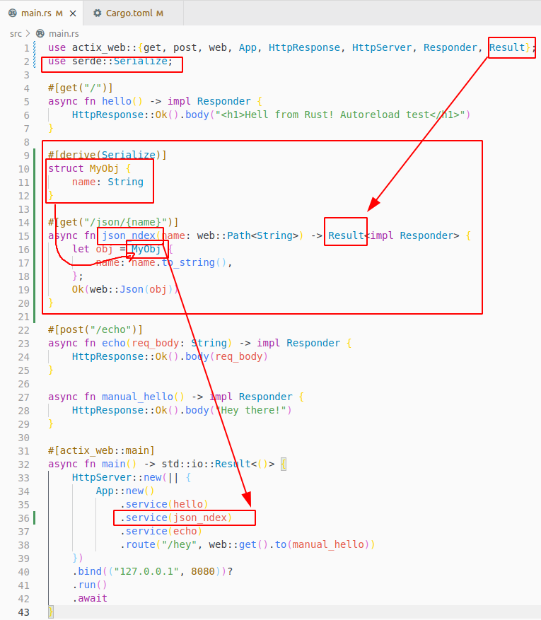

# api-rust-actix_web

## (optional) Install Rust and Rustup
rustup tool, which installs the latest stable version of Rust. You might be prompted for your password.
If you’re using Linux or macOS, open a terminal and enter the following command:

```sh
curl --proto '=https' --tlsv1.2 https://sh.rustup.rs -sSf | sh
```
select steps:
```sh
1) Proceed with installation (default)
```

Final Terminal otuput

```
Rust is installed now. Great!

To get started you may need to restart your current shell.
This would reload your PATH environment variable to include
Cargo's bin directory ($HOME/.cargo/bin).

To configure your current shell, run:
source $HOME/.cargo/env
```

If you using VSC editor must install this extension:
[https://marketplace.visualstudio.com/items?itemName=rust-lang.rust](https://marketplace.visualstudio.com/items?itemName=rust-lang.rust)


## Install Actix Web
Most importantly: Actix Web runs on Rust 1.54 or later and it works with stable releases.

create new directory and package with command:
```sh
cargo new api-rust-actix_web
# result
Created binary (application) `api-rust-actix_web` package
```

Add actix-web as a dependency of your project by adding the following to your Cargo.toml file.
```
[dependencies]
actix-web = "4"
```

Edit file src/main.rs like this:
```rs
use actix_web::{get, post, web, App, HttpResponse, HttpServer, Responder};

#[get("/")]
async fn hello() -> impl Responder {
    HttpResponse::Ok().body("Hello world!")
}

#[post("/echo")]
async fn echo(req_body: String) -> impl Responder {
    HttpResponse::Ok().body(req_body)
}

async fn manual_hello() -> impl Responder {
    HttpResponse::Ok().body("Hey there!")
}

#[actix_web::main]
async fn main() -> std::io::Result<()> {
    HttpServer::new(|| {
        App::new()
            .service(hello)
            .service(echo)
            .route("/hey", web::get().to(manual_hello))
    })
    .bind(("127.0.0.1", 8080))?
    .run()
    .await
}
```
Notice: this command will take some time around 1-2 minutes!
to start surver trun command:
```
cargo run
```
Final result must be somting like this:

```
Compiling api-rust-actix_web v0.1.0 (/home/ivanov/sivanov/api-rust-actix_web)
    Finished dev [unoptimized + debuginfo] target(s) in 1m 08s
     Running `target/debug/api-rust-actix_web`
```
Open in browser [http://127.0.0.1:8080/](http://127.0.0.1:8080/)

Now must be visible blank page only with text: "Hello world!"


To stop server press : "Ctrl + C"
Next start of web server will be more fast:
```
cargo run
    Finished dev [unoptimized + debuginfo] target(s) in 0.06s
```

## Auto-Reloading Development Server
During development it can be very handy to have cargo automatically recompile the code on changes. This can be accomplished very easily by using cargo-watch.

Optional - Installing cargo wath:
```
cargo install cargo-watch
```
WAit again long time :)

Exmaple command:
```
cargo watch -x 'run --bin [your_app_name]'
```

now run command with your app name:
```
cargo watch -x 'run --bin api-rust-actix_web'
```
result:
```
Finished dev [unoptimized + debuginfo] target(s) in 4.18s
```
**Notice**: this command will nor refresh automatically browser!
To test autoreload speed change  file main.rs and row like this
```rs
#[get("/")]
async fn hello() -> impl Responder {
    HttpResponse::Ok().body("<h1>Hell from Rust! Autoreload test</h1>")
}
```
when you save cahnges to file server will auto-reload all automatically

## Add .gitignore file
because directory that contains all compiled files and executables "target"
is around:
```
./target
1 587 items, totalling 982,4 MB
```


```
#.gitignore

# will have compiled files and executables
debug/
target/

# These are backup files generated by rustfmt
**/*.rs.bk

```


## Add JSON support
Add to end of the file Cargo.toml  rows:
```
# for JSON  data
serde = { version = "1.0", features = ["derive"] }
```

Open and add to file src/main.rs :
Notice on row  on last position we have new include
and new new 2-nd "use" row

```rs
use actix_web::{get, post, web, App, HttpResponse, HttpServer, Responder, Result};
use serde::Serialize;
```
add after row 8 this new rows:
```rs
#[derive(Serialize)]
struct MyObj {
    name: String
}

#[get("/json/{name}")]
async fn json_ndex(name: web::Path<String>) -> Result<impl Responder> {
    let obj = MyObj {
        name: name.to_string(),
    };
    Ok(web::Json(obj))
}
```

and add after row 25 new with content:
```rs
.service(json_ndex)
```
final look of all code:


Now is time to visit URL raletaed with JSON responce.
Open [http://127.0.0.1:8080/json/test](http://127.0.0.1:8080/json/test)

brwoser must return text like this:
```json
{"name":"test"}
```
if you replace last part of url from "test" to "rust" and hit enter you must see:
```json
{"name":"rust"}
```


for more information see oficial documentaion : [https://actix.rs/docs/response/](https://actix.rs/docs/response/)


## target direcory statistics
```
Add JSON support with serde
1 939 items, totalling 1,3 GB
```


Time investet in this tutorial: 2 h. 30 min.